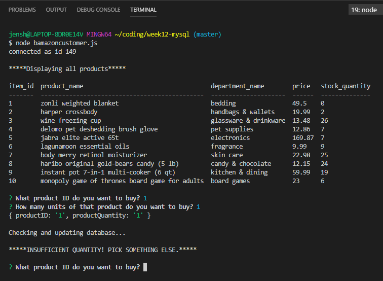

Required Installation:
- npm install mysql
- npm install inquirer
- npm install console.table

To run the application:
- Enter "node bamazoncustomer.js" on the command line.

To start the application:
- A table of products in the database will be displayed.
- At the first prompt, type in item_id (number) of product you want to purchase. 
- At the second prompt, type in quantity.  

If quanity in database is less than quantity entered, then you will get this message "Insufficient quantity! Pick something else." and order will not be placed.

If quanity in database is greater than quantity entered, then database will be updated accordingly and price of the total order will be displayed.

